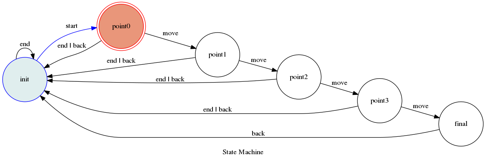

#TOC-2018 Zames
## information
```
student id = e44041034
name  = 張景雲
```
## fsm
<br>

They say a good example is worth 100 pages of API documentation, a million directives, or a thousand words.<br>

Well, "they" probably lie... but here's an example anyway:<br>
<br>
<br>
<br>